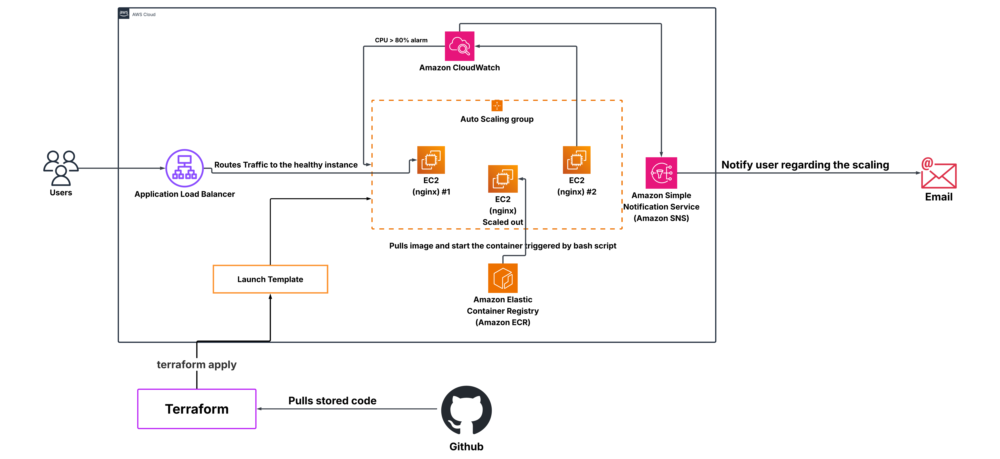

# Auto-Scaling Containerized Web Application on AWS

## Overview

This project simulates a production-grade like web infrastructure on AWS. The goal was to build something that could handle traffic spikes automatically without manual intervention.

An Nginx app runs inside Docker containers, with images stored in ECR. When a new EC2 instance spins up, a User Data bash script pulls the latest image and starts the container automatically — no SSH, no manual setup.

Auto Scaling is triggered by CloudWatch when CPU hits 80%, with SNS sending email alerts in real time. Load testing was done using stress-ng to verify the scaling actually fired under simulated production load.

Built to understand how large-scale systems handle unpredictable traffic without downtime — and to get hands-on with AWS autoscaling beyond just reading the docs.

## Architecture Diagram



## How It All Works Together

When someone visits your app:
1. Their request hits the **Load Balancer** (traffic cop)
2. Gets routed to the healthiest **EC2 instance** in the group
3. That instance runs your **containerized app** (stored in ECR)
4. If CPU gets too high, more instances spin up automatically
5. You get notified via email if anything looks off


## What I Built

🚀 **Automatic Scaling** - App grows when busy, shrinks when quiet  
🛡️ **Self-Healing** - Dead instances get replaced automatically  
🔄 **Infrastructure as Code** - Everything defined in Terraform (no clicking around AWS Console)  
🐳 **Containerized** - Docker images pulled from ECR on every instance launch  
📊 **Smart Monitoring** - CloudWatch watches CPU, SNS sends you alerts  
⚡ **Zero Downtime** - New versions deploy smoothly without dropping requests  

## Before You Start

You'll need:
- An AWS account (with permission to create EC2, VPC, load balancers)
- [Terraform](https://www.terraform.io/downloads.html) installed
- [Docker](https://www.docker.com/products/docker-desktop) (to build your app image)
- [AWS CLI](https://aws.amazon.com/cli/) set up with your credentials
- A GitHub repo to store everything

## Get It Running (5 Minutes)

### Step 1: Grab the Code
```bash
git clone https://github.com/yourusername/aws-autoscaling-app.git
cd aws-autoscaling-app
```

### Step 2: Push Your App to ECR
First, create a container repository in AWS:
```bash
aws ecr create-repository --repository-name nginx-app --region us-east-1
```

Then build and push your Docker image:
```bash
docker build -t nginx-app:latest .
aws ecr get-login-password --region us-east-1 | docker login --username AWS --password-stdin <YOUR_AWS_ID>.dkr.ecr.us-east-1.amazonaws.com
docker tag nginx-app:latest <YOUR_AWS_ID>.dkr.ecr.us-east-1.amazonaws.com/nginx-app:latest
docker push <YOUR_AWS_ID>.dkr.ecr.us-east-1.amazonaws.com/nginx-app:latest
```

### Step 3: Deploy Everything with Terraform
```bash
cd terraform/
terraform init          # First time only - sets up Terraform
terraform plan          # See what's about to be created
terraform apply         # Go! Creates load balancer, instances, alarms, etc.
```

### Step 4: Test It
```bash
# Get your load balancer's web address
aws elbv2 describe-load-balancers --region us-east-1 --query 'LoadBalancers[0].DNSName'

# Visit it in your browser or curl it
curl http://<YOUR-ALB-ADDRESS>
```

Done! Your app is now live and auto-scaling. ✅

## Inside the Machine

### The Load Balancer (Traffic Cop)
Sits in front of all your instances and decides who gets the traffic. Has health checks running constantly—if an instance isn't responding, it stops sending requests there. When you scale up, new instances automatically register. When they die, traffic instantly routes around them.

### Auto Scaling Group (The Elastic Manager)
Keeps 2-6 instances running at all times. If CPU hits 80% (because your app is getting hammered), it spins up new instances automatically. Once the load drops back down, it kills the idle ones. You only pay for what you actually use.

### The Container (Docker)
Your Nginx app lives in a Docker image stored in AWS's ECR (think of it as Docker Hub, but private and connected to your AWS account). When a new instance launches, a User Data script automatically:
- Installs Docker
- Logs into ECR using IAM permissions (no hardcoded passwords!)
- Pulls the latest image
- Starts the container

No manual SSH-ing around. No "wait, which version is running on this instance?" frustration.

### The Brain (CloudWatch + SNS)
Watches your CPU like a hawk. The moment it creeps past 80%, an alarm fires. SNS shoots you an email saying "Hey, things are getting hot—check the dashboard." You can also set up dashboards to visualize everything in real time.

### Infrastructure as Code (Terraform)
Instead of clicking around the AWS Console (which is error-prone and hard to repeat), everything is defined in `.tf` files. Change a line, run `terraform apply`, boom—infrastructure updates. Push to Git, collaborate with your team, keep history of every change.

## Watch It Scale (The Fun Part)

Want to see the auto-scaling in action? Let's hammer the app with traffic and watch AWS spin up new instances.

### Step 1: SSH Into an Instance
```bash
ssh -i your-key.pem ec2-user@<instance-ip>
```

### Step 2: Crank Up the CPU
```bash
# Install stress-ng (a tool that eats CPU)
sudo yum install -y stress-ng

# Burn 4 CPU cores for 5 minutes
stress-ng --cpu 4 --timeout 300s --verbose
```

### Step 3: Watch the Magic
Open the AWS Console and:
- Go to **Auto Scaling Groups** → watch instance count climb from 2 to 3, 4, maybe 5
- Check **CloudWatch** → CPU graph spikes, then more instances come online
- Look at **Target Group** → new instances appear and turn green as health checks pass
- Check your email → SNS alert tells you the alarm fired

### What You're Seeing
1. **Minute 0-2**: Stress starts, CPU climbs toward 80%
2. **Minute 2-3**: Alarm triggers, ASG receives scaling request
3. **Minute 3-4**: New EC2 instances launch (takes ~2 min)
4. **Minute 4-5**: Load Balancer health checks pass, traffic routes to new instances
5. **Minute 6+**: After stress stops, instances cool down and extra ones get terminated

This is production-ready auto-scaling working the way it should.

## Keeping Tabs on Things

### What Gets Monitored?
- **CPU Utilization** - How hard your instances are working
- **Network Traffic** - Incoming and outgoing bytes
- **Healthy Host Count** - How many instances are actually serving traffic
- **Request Count** - How many requests the load balancer handled

### Getting Alerts
Set your email in the Terraform config:
```hcl
sns_email = "your-email@company.com"
```

You'll get messages like: "Production server CPU alarm triggered" when things get spicy. From there, you can log into the AWS Console, check the dashboard, or trigger manual scaling if needed.

### Custom Dashboard
Terraform creates a CloudWatch dashboard so you can see all metrics in one place—no hunting through tabs.

## Money Matters

This setup is deliberately cost-conscious:
- **t3.medium instances** - Cheap, bursty, perfect for most apps
- **Minimum 2 instances** - Just enough for high availability, not over-engineered
- **Auto-scaling** - You only pay when you need the resources
- **Pro tip**: Switch to Spot Instances in the Terraform code for 70% savings (trade off: might get interrupted randomly)

## Security (Doing It Right)

✅ **IAM Roles** - Instances only get permissions they need, nothing more  
✅ **Security Groups** - Only the load balancer can talk to instances  
✅ **No Secrets in Code** - ECR authentication uses IAM, not hardcoded passwords  
✅ **Terraform State** - Store in S3 with encryption enabled  
✅ **Health Checks** - Dead or unhealthy instances don't get traffic  

Basically, following the principle: "Give things the minimum they need to work, nothing more."  

## File Structure

```
.
├── README.md
├── Dockerfile              # Nginx container definition
├── docker/                 # Application source files
│   └── index.html
├── terraform/
│   ├── main.tf
│   ├── launch_template.tf
│   ├── scaling_policy.tf
│   ├── cloudwatch.tf
│   ├── variables.tf
│   ├── outputs.tf
│   ├── terraform.tfvars
│   └── user_data.sh        # Instance initialization script
└── scripts/
    └── stress_test.sh      # Load testing script
```

## When You're Done (Kill It All)

Don't forget—AWS will keep charging you while resources are running. Tear it down when done:
```bash
cd terraform/
terraform destroy
```

Terraform will show you everything it's about to delete. Say yes, and in a few minutes everything's gone and you stop bleeding money.

## What I Learned Building This

**Infrastructure as Code is a game-changer.** I can't stress this enough. The first time I deployed this, I clicked around the console for hours. Now? Automated and repeatable. I can nuke it all and rebuild in minutes. That's powerful.

**Automation beats manual work.** The User Data script saves me from SSH-ing into every instance to install Docker. Just tag the new instance, and it's ready to go. No surprises, no "wait, did I run that command?"

**Monitoring prevents pain.** Setting up CloudWatch alarms before you need them is like having insurance. The email alert gave me peace of mind that if something broke, I'd know immediately.

**Load testing is essential.** I didn't trust the auto-scaling until I actually stress-tested it. Seeing new instances spin up in real-time confirmed everything works as designed.

## What's Next?

This is version 1.0. Here are ideas for making it even better:

- **Multi-region failover** - If AWS's entire us-east-1 region explodes, automatically fail over to us-west-2
- **Spot Instances** - Cut costs by 70% (but trade risk of interruption)
- **Kubernetes (EKS)** - If your app gets bigger, move to container orchestration
- **CI/CD Pipeline** - Every GitHub push automatically rebuilds the Docker image and deploys it
- **Smarter Scaling** - Instead of just CPU, scale based on request count or custom metrics
- **Blue-Green Deployments** - Swap traffic between two identical environments for zero-downtime updates

## Questions? Issues?

- Check the AWS docs if something breaks
- Read the Terraform code—it's self-documenting
- Run `terraform plan` before `apply` to see what's changing

## Files

```
.
├── README.md                    ← You are here
├── Dockerfile                   # Your app in a box
├── docker/
│   └── index.html              # Simple demo page
├── terraform/
│   ├── main.tf                 # VPC, load balancer, networking
│   ├── launch_template.tf       # EC2 instance configuration
│   ├── scaling_policy.tf        # When to scale up/down
│   ├── cloudwatch.tf            # Alarms and dashboards
│   ├── variables.tf             # Inputs you can customize
│   ├── outputs.tf               # What Terraform gives back
│   ├── terraform.tfvars         # Your actual config values
│   └── user_data.sh             # What runs when instances boot
└── scripts/
    └── stress_test.sh           # Load testing script
```

---

**Built with ❤️ to eliminate manual DevOps work**

Questions? Open an issue. Found a bug? PR welcome.
